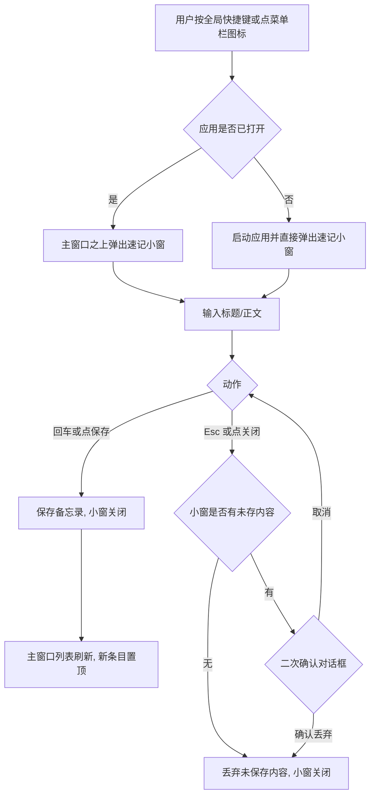
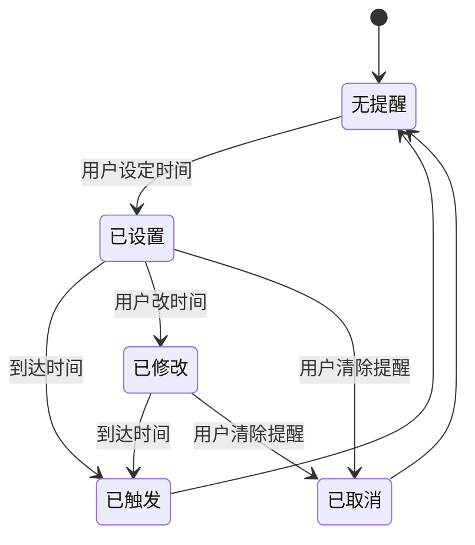

# My Echo 轻量强化包 PRD

> 创建日期：2026-09-15
> 适用版本：v0.1.0 之上（P0 已交付）
> 审阅人：Melody

## 1. 背景与目标

My Echo 已完成 P0（F01 增删改查、F02 搜索排序）并交付 v0.1.0。产品定位是 Mac 本机单用户日常记录工具，纯本地存储，无网络、无账号。当前版本的短板集中在三处：记录形态单一（只有纯文本）、组织手段只有关键词搜索、缺少主动提醒与快捷入口。

本轮「轻量强化包」共 6 个功能，全部来自竞品调研清单中改动轻、见效快的项目，目标如下：

- 记录更快：全局速记（N05）把「想起来 → 记下来」的路径缩短到一次快捷键。
- 记录更多形态：待办勾选（N03）让清单类内容能标记完成；标签（N02）让碎片笔记能按主题聚拢。
- 从被动到主动：本地提醒（N10）让记录可以被「叫回来」。
- 体验补齐：深色模式与主题（N16）、键盘快捷键（N18）覆盖桌面端高频期待。

验收口径：6 项功能各自满足第 5 节验收标准，且不破坏已交付的 F01/F02（回归通过）。

## 2. 功能总览

| # | 功能 | 说明 |
|---|---|---|
| N02 | 标签系统 | 一条备忘录可挂多个标签；支持标签管理（增删改）与按标签筛选列表 |
| N03 | 待办勾选清单 | 正文中以 `- [ ]` 开头的行渲染为可勾选条目，点击切换完成态，列表显示完成进度 |
| N05 | 全局速记 | 菜单栏图标常驻；点击图标或按全局快捷键弹出速记窗，输入标题与正文回车即存 |
| N10 | 本地提醒 | 备忘录可设置提醒时间，到点通过 macOS 本地通知弹出；可取消/修改提醒 |
| N16 | 深色模式与主题 | 主题三态：浅色 / 深色 / 跟随系统，用户选择持久化；现有设计令牌扩展深色调色板 |
| N18 | 键盘快捷键体系 | 新建、保存、删除、搜索聚焦、新建速记等高频操作绑定快捷键，设置页内可查 |

## 3. 功能详情

### 3.1 N02 标签系统

**业务规则**
- 一条备忘录可挂 0 个到多个标签；一个标签可被多条备忘录使用。
- 标签名必填，去除首尾空格后非空；长度不超过 30 个字符；同一应用内标签名不重复（重复创建时提示「标签已存在」，大小写不敏感）。
- 标签名允许中英文、数字与常见标点，不允许换行。
- 数据层面需要记录：标签本身（名称、创建时间）、备忘录与标签的对应关系。备忘录删除时，其标签关系一并删除；标签删除时，仅解除关联，不删除备忘录。
- 颜色属性远期考虑（本期不做标签颜色）。

**交互逻辑**
- 列表视图左侧（或工具栏下方）固定标签栏：展示全部标签与「全部」项；点选某标签，列表只显示挂该标签的备忘录，仍按更新时间倒序。
- 编辑器视图正文下方为标签区：已挂标签以圆角条展示，可点 × 移除；输入名称回车可添加新标签，若名称已存在则直接挂上该标签；支持从全部标签中选择（输入时联想已有标签）。
- 标签栏中选中态样式与「全部」明确区分；空标签时标签栏显示「暂无标签」。
- 标签不再被任何备忘录使用时自动从标签栏消失（数据仍保留，重新挂载即恢复）——本期采用「随用随现」，不对空标签做回收站交互。

**边界与异常**
- 标签筛选与关键词搜索同时生效（先按标签过滤，再按关键词匹配），两者皆空时等同「全部 + 不搜索」。
- 筛选后无结果时展示对应空态文案：「该标签下暂无备忘录」。
- 备忘录标题编辑不影响标签；导入备份（F05，远期）包含标签数据。

**承接关系**：为 F02 增加结构化筛选维度，与关键词搜索互补。

### 3.2 N03 待办勾选清单

**业务规则**
- 正文中独占一行的 `- [ ]`（未完成）与 `- [x]`（已完成）视为待办条目；其余文本不受影响。
- 勾选状态切换仅改变该行方括号内容，不触碰正文其他部分。
- 完成进度 = 已完成条目数 / 全部条目数，仅当正文含至少 1 个待办条目且该备忘录位于列表时展示。

**交互逻辑**
- 编辑器：待办行渲染为可点击复选框 + 文本，点击复选框即切换 `[ ]` 与 `[x]`，文本仍可编辑，编辑后立即保存行为与普通正文一致。
- 列表条目：正文含待办时，条目上以「2/5」形式展示完成进度。
- 勾选不触发 updated_at 刷新之外的特殊逻辑（进度由正文实时计算，不单独存储）。

**边界与异常**
- `- [ ]` 与 `- [x]` 视为正文普通文本参与关键词搜索（搜索「待办行文本」可命中该备忘录）。
- 半角与全角空格不视为待办语法，保持纯文本展示。
- 后续若引入 Markdown 渲染（N01，未纳入本期），勾选规则与之保持一致。

**承接关系**：扩展 F01 的记录形态，不新增数据结构。

### 3.3 N05 全局速记

**业务规则**
- 速记窗本质是新建备忘录的快捷入口：标题必填（规则同 5.4 校验），正文允许为空；保存后走与正常新建完全相同的落地规则（时间戳、排序）。
- 快捷键采用系统级全局快捷键（非应用内），默认由壳层注册，可在设置中查看（本期不允许改键，改键列远期）。

**交互流程**

**边界与异常**
- 速记小窗必须置顶、默认获得焦点，标题输入框自动聚焦。
- 速记窗已有未保存内容时，按 Esc 或点关闭需弹二次确认（「丢弃未保存的速记？」），确认后丢弃并关闭，取消则留在窗内。
- 触发新速记时若已有速记窗打开，焦点回到已有小窗，不叠加新窗。
- 主窗口关闭行为：默认关闭主窗口即退出应用（macOS 惯例）；设置面板提供开关「关闭主窗口后保留在菜单栏」，开启后关闭主窗口仅隐藏窗口，从菜单栏退出才完全退出。
- 菜单栏图标无论开关状态均常驻；点击菜单栏图标打开主窗口（作为速记之外的第二入口）。

**承接关系**：强化 F01 新建效率，配合 N18 快捷键形成闭环。

### 3.4 N10 本地提醒

**业务规则**
- 每条备忘录可设置 1 个提醒时间，允许为空（即不提醒）；提醒时间不得早于当前时间（过去时间视为立即无效并提示）。
- 时间精度到分钟；存储为具体时间点（非重复提醒，重复规则远期）。
- 到期后走 macOS 本地通知（系统通知中心），不联网；通知内容包含备忘录标题。

**状态流转**

**交互逻辑**
- 编辑器内提醒区：显示当前提醒（如「今天 14:30」），可修改或清除；未设置时显示「添加提醒」入口。
- 列表条目展示提醒标记（如小铃铛图标与时间），提醒已过期且未取消的条目视觉弱化该标记。
- 点击系统通知唤醒应用并打开对应备忘录。

**边界与异常**
- 系统通知权限：首次设置提醒时若系统权限未授予，提示用户授予；权限被拒时保存提醒但明示「通知可能不显示」，并在设置页提供跳转系统设置的入口。
- 应用未运行期间的提醒：由系统调度到点弹出（通知权限）。应用重启后，未到期的提醒仍有效（基于存储的时间恢复调度）。
- 备忘录删除时其提醒一并移除；从回收站恢复（F04，P1 规划中）时提醒随数据一并恢复：未到期的重新调度、已到期的恢复后标记为过期态且不再触发。
- 数据层面：备忘录需要新增「提醒时间」字段，允许空值。

**承接关系**：把 5.3 备忘录实体从「记事」扩展到「可被叫回」；与 F05 加密备份兼容（提醒字段纳入备份范围）。

### 3.5 N16 深色模式与主题

**业务规则**
- 主题三态：跟随系统 / 浅色 / 深色；默认「跟随系统」（与现状一致，无感升级）。
- 用户选择持久化保存在本机（应用配置，不进入备忘录数据）。

**交互逻辑**
- 设置入口：列表工具栏增加设置按钮，弹出设置面板。面板含三块设置：主题三态选择（N16）、「关闭主窗口后保留在菜单栏」开关（N05 关闭行为）、快捷键自定义（N18）。
- 切换即时生效，无需重启；「跟随系统」模式下应用外观随 macOS 外观实时变化。
- 深色模式复用并扩展既有设计令牌（CSS 变量），覆盖全部界面（列表、编辑器、速记窗、设置面板、通知弹窗无样式概念，走系统）。

**边界与异常**
- 深色下所有文案与控件对比度满足可读（浅色文字 on 深色底，标签条、进度、错误提示条均有深色配色）。
- 主题选择不影响导出备份内容。

**承接关系**：升级现有 prefers-color-scheme 跟随能力，从「自动」到「可控」。

### 3.6 N18 键盘快捷键体系

**业务规则**
- 高频操作与默认绑定（macOS 惯例）：

| 操作 | 默认快捷键 |
|---|---|
| 新建备忘录 | Cmd+N |
| 保存（编辑器内） | Cmd+S |
| 删除（编辑器内） | Cmd+Backspace |
| 聚焦搜索框 | Cmd+F |
| 新建速记（全局） | Cmd+Shift+Space |
| 关闭速记窗 | Esc |

- 支持自定义改键：除「关闭速记窗 Esc」固定外，其余 5 项均可在设置面板自定义；修改后持久化保存在本机。
- 局部快捷键在主窗口与编辑器各自上下文生效；全局快捷键仅「新建速记」一项。
- 自定义组合须包含至少一个修饰键（Cmd / Option / Control / Shift）或为功能键；同一上下文内不允许两个操作绑定相同组合。

**交互逻辑**
- 设置面板「快捷键」页逐项展示当前绑定；点击某项进入录制态（提示「按下新组合」），按下新组合即保存并退出录制态。
- 冲突处理：新组合与该上下文内已有绑定重复时提示「该组合已被『XX』使用」，保存被拒；与其他上下文或系统冲突不硬性拦截，若实测与系统冲突，以系统为准并在该项旁提示「可能与系统快捷键冲突」。
- 每项提供「恢复默认」入口；提供「全部恢复默认」按钮。
- 快捷键行为与对应按钮点击行为完全一致（如 Cmd+N 等同点击「新建」）。

**边界与异常**
- 录制态下按 Esc 取消录制，保持原绑定不变。
- 焦点的输入区域内的文本编辑快捷键（复制粘贴等）不受自定义体系影响。

**承接关系**：覆盖 F01/F03/F04 高频操作，为效率兜底。

## 4. 影响分析

### 4.1 对存量数据与字段

| 影响 | 说明 |
|---|---|
| 新增关系数据 | 标签与「备忘录-标签」关系，属新增数据，不影响存量备忘录 |
| 备忘录新增字段 | 「提醒时间」可空字段；存量备忘录默认无提醒，无需迁移 |
| 正文语义 | `- [ ]` 待办语法对存量正文是纯文本展示变化（由渲染决定），不修改原始数据 |

### 4.2 对既有流程与功能

- F01/F02 全部保留，回归验证范围：CRUD、排序、搜索在加入标签筛选、待办渲染后的正确性。
- F04 回收站（P1 规划中）：本期要求「删除备忘录连带删除其标签关系与提醒」在数据结构上可表达。
- F05 加密备份（P2 规划中）：导出格式需包含标签与提醒，本期仅在 PRD 中登记要求，不实现。
- 设置面板为本期新引入的统一入口（主题 + 快捷键），后续功能设置挂载于此。

## 5. 验收标准

1. N02：备忘录可增删多个标签；标签名去重与长度校验生效；按标签筛选结果正确且与关键词搜索可叠加；删除备忘录后关系中无残留。
2. N03：`- [ ]` 行渲染为复选框并可切换；切换后正文准确变更 `[ ]`/`[x]`；列表进度「2/5」计算正确；无待办条目不显示进度。
3. N05:菜单栏图标常驻；全局快捷键可唤起速记窗；回车保存后列表置顶出现新条目且重启后仍在；Esc 关闭不落库。
4. N10：过期时间设置被拦截；到点收到本地通知且通知含标题；点通知打开对应备忘录；重启后未到期的提醒仍能触发。
5. N16：三态切换即时生效并持久化；深色下全部界面元素可读、无白字白底或黑字黑底。
6. N18：默认绑定行为与对应按钮一致；自定义改键保存后新组合生效且重启后保留；同上下文重复绑定被拒；恢复默认可用。
7. N05 补充：速记窗含未存内容时关闭须弹二次确认，确认后不落库；设置开关「关闭主窗口后保留在菜单栏」默认关闭，开启后关窗仅隐藏、托盘退出才完全退出。

## 6. 风险与依赖

- 系统依赖：N10 提醒与 N05 托盘依赖 macOS 通知权限与菜单栏策略；权限被拒时的降级体验（提示 + 设置入口）已定义，落地时以实测为准。
- 安全约束：全部功能不引入网络与账号；速记、提醒均本地执行，符合硬约束。
- 数据一致性：标签关系与提醒需与 F04 软删规划兼容，避免出现「孤儿数据」。
- 无确定性风险与时间表；依赖项为设计令牌扩展（N16）先于前端实现，全局快捷键与托盘能力依赖壳层封装。

## 7. 已裁定决策

产品负责人 2026-09-15 裁定，以下规则已落入正文：

1. 速记窗含未存内容时关闭需二次确认。
2. 关闭主窗口默认退出应用；设置面板提供「保留在菜单栏」开关，菜单栏图标常驻。
3. 从回收站恢复备忘录时提醒一并恢复（未到期重新调度、已到期标记过期不触发），属 F04 落地时行为。
4. 设置面板提供快捷键自定义改键界面（冲突检测 + 恢复默认）。

> 审阅通过后：按变更约定更新 AGENTS.md → Planner 输出建表 SQL 与 Command 契约 → UI_Designer 更新设计 → 进入开发与审查循环。