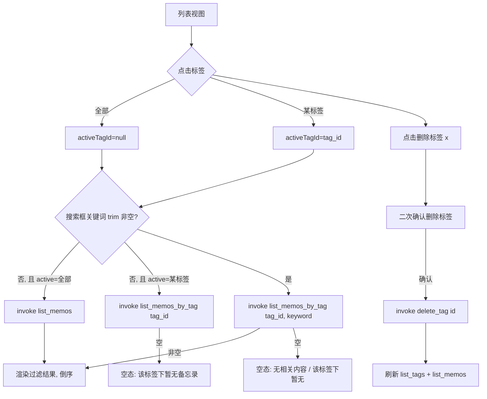
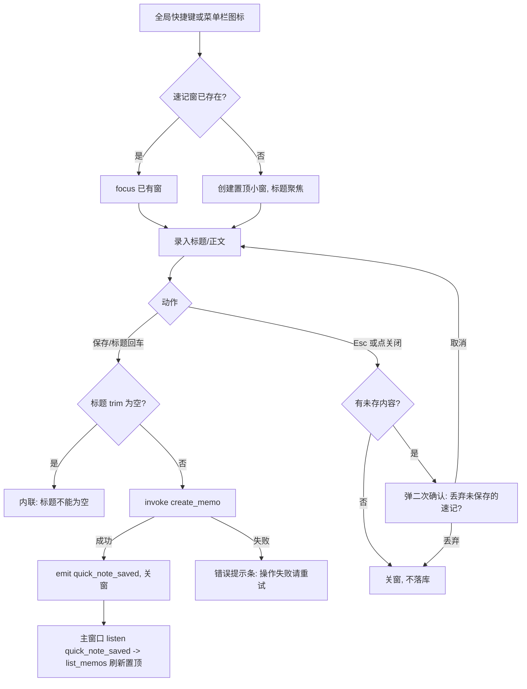
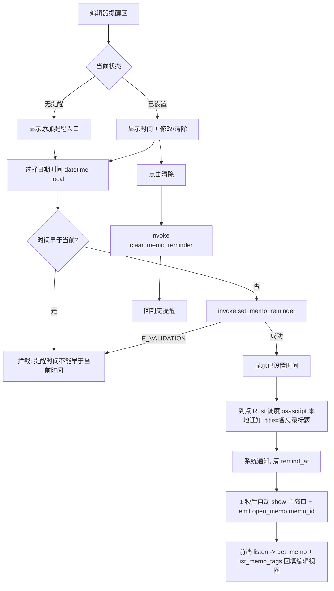
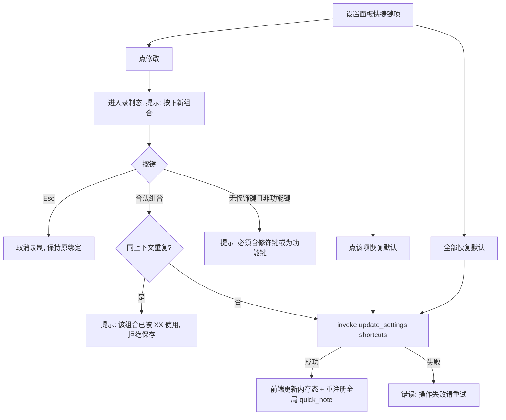
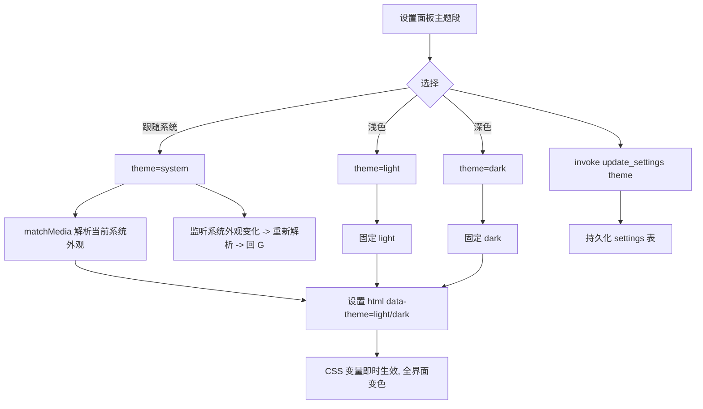

# My Echo 轻量强化包（F06–F11）UI 设计增量

> 范围：标签（F06）、待办勾选（F07）、全局速记（F08）、本地提醒（F09）、主题（F10）、快捷键（F11）。
> 事实源：AGENTS.md 5.2/5.3/5.4；交互细节：docs/prd-轻量强化包.md；契约：docs/planner-轻量强化包.md §2。
> 本文为增量设计，严格继承 docs/ui_design.md 的 P0 设计令牌（CSS 变量）、7 组件规范与「单页双视图」结构，不推倒重来。
> 本文只产出 UI/UX 设计规范，不写业务代码、不改契约。

---

## 0. 增量总览（决策先行）

| 决策项 | 选择 | 理由 |
|---|---|---|
| 标签栏位置 | 列表视图横向标签条，位于「工具栏之下、搜索框之上」 | 见 1.1 |
| 视图组织 | 主窗口仍单页双视图（`view: 'list' \| 'editor'`）；速记窗、设置面板为独立承载，不并入主视图状态机 | 速记窗是独立 WebviewWindow（契约 S-09），设置面板为浮层 |
| 速记窗形态 | 独立小窗 420×340、无边框（带轻量悬停关闭钮）、置顶、聚焦，标题自动聚焦 | 见 1.5 |
| 主题切换机制 | `html[data-theme="light"\|"dark"]` 属性制；`system` 态由 matchMedia 解析后仍落为 light/dark 属性 | 见 3.2 |
| 深色令牌策略 | 复用 P0 全部 15 个既有变量（不改名、不改 light 值），新增一组专属 token（tag/chip/checkbox/progress/reminder/settings/quicknote）各配 light+dark | 见 3.1 |
| 标签「改」的 UX | 本期无 `rename_tag` 命令；标签改名 = 在标签栏删除旧标签 + 新建/挂载新名，由 `set_memo_tags` 的 get-or-create 语义承担 | 与契约一致，不虚构命令 |

---

## 1. 页面与视图增量

### 1.1 标签栏位置决策：横向标签条（工具栏之下、搜索框之上）

**决策：横向标签条**，插入到列表视图「标题栏区」与「搜索框」之间，而非左侧竖栏。

理由：
1. **继承 P0 单列纵向布局**——P0 明确「不引入网格/侧栏」，左侧竖栏需要新增两栏布局框架，属推倒重来；横向条在既有上下堆叠结构中插入一行即可，改动最小。
2. **窄窗不被挤压**——默认窗口 720×560、最小 560×440，备忘录是窄文本场景，竖栏会侵占本就有限的横向阅读宽度；横向条只占用约 36px 高度，且可横向滚动容纳多标签。
3. **筛选语义与视觉顺序一致**——「标签先过滤 → 关键词再匹配」（AGENTS.md 5.4），横向条在搜索框**上方**，上下相邻、自上而下恰恰对应过滤的先后顺序，用户一眼理解叠加关系；若放在搜索框下方，会打断「搜索—列表」的操作流。
4. **复用 P0 空态与列表滚动区**——标签条独立成行，列表区滚动不受影响，与既有「列表视图信息层级」叠加清晰。

**标签条结构（自左向右）**：
1. 「全部」项（选中表示不过滤，等价 `list_memos`）。
2. 各标签粒 `TagChip`（按 `list_tags` 返回，`memo_count > 0` 才显示，实现 PRD「随用随现」）。
3. 末尾「+」创建标签按钮（调 `create_tag`）。
4. 标签粒 hover 显示「×」，点击删除标签（调 `delete_tag`，删除前需二次确认，见 2.1）。
5. 可选横向滚动；标签过多时左右箭头/滚动条出现。

### 1.2 列表视图——列表项新元素（进度 + 铃铛）

在 P0 列表项（标题 + 时间 + 正文单行摘要）基础上新增两类元素，位置规则：

```
┌──────────────────────────────────────────────┐
│ 标题（font-weight-medium）          [铃铛·时间] │  ← 铃铛在时间左侧
│ 正文单行摘要（省略号截断）        「2/5」进度徽标 │  ← 进度在右侧副行
└──────────────────────────────────────────────┘
```

- **进度「2/5」**（`TodoItem` 进度徽标）：仅当正文含 ≥1 个待办条目时展示；`已完成数 / 总数` 由前端实时解析 `content` 计算，不入库（契约 2.6）。样式为小型徽标（`--radius-full`），已完成数（分子）用 `--color-text-secondary`，总数（分母）用 `--color-text-tertiary`；全部完成时徽标可整体转 `--color-success` 以示完成（可选强化，不强制）。
- **铃铛标记**（`ReminderBadge`）：仅当 `memo.remind_at` 非空时展示，位于时间文本左侧；未到期用 `--color-reminder`，到期后（已触发被清空为空，前端不展示；若某窗口仍读到过期值则以 `--color-text-tertiary` 弱化）。展示为小铃铛图标，hover 可显示完整提醒时间 tooltip。

### 1.3 编辑器视图——新增标签编辑区与提醒区

在 P0 编辑表单「标题输入框 → 正文 TextArea → 底部操作区」的中间插入两个新区域，更新后自上而下层级：

1. 标题栏区（返回 + 删除，不变）。
2. 标题输入框（不变）。
3. **标签编辑区**（新增，标题之下正文之上）：
   - 已挂标签以 `TagChip` 横向流式排列，每粒带「×」，点击解除该备忘录与此标签的关联。
   - 末尾一个轻量标签输入框（placeholder「添加标签」），输入时联想已有标签（下拉建议，命中可点选直接挂载），回车确认挂载/新建。
   - 已存在的标签名：直接挂上（get-or-create 复用，不报「已存在」）；全新标签名：自动新建并挂上。
   - 保存行为：标签区改动在点击「保存」时随 `set_memo_tags`（覆盖式）一并提交；编辑回填时并行 `get_memo` + `list_memo_tags`。
4. **提醒区**（新增，标签区之下正文之上）：见 `ReminderField`（2.3 / 4.6）。
5. 正文 TextArea。
6. 底部操作区（取消 + 保存，不变）。

> 提醒区放正文之上、标签区之下：提醒是「这条记录何时被叫回」的元信息，与内容（标题/正文）分离，故不嵌进正文；标签是最贴近内容的分类，紧随标题。

### 1.4 列表视图 / 编辑器视图——新增状态补充（空态 / 加载态 / 错误态）

在 P0 1.5/1.6 状态表基础上**增量补充**以下状态（不做删改）：

| 视图 | 状态 | 触发条件 | 界面呈现 / 文案 |
|---|---|---|---|
| 列表-标签条 | 标签加载态 | `list_tags` 请求中 | 标签条区域显示轻量骨架（2–3 个灰色短条）或静默 |
| 列表-标签条 | 无标签空态 | `list_tags` 返回空或全部 `memo_count=0` | 「全部」项 + 文案「暂无标签」 |
| 列表-标签条 | 标签加载失败 | `list_tags` 抛 `E_INTERNAL` | 标签条内联弱提示 + 重试；列表仍可按「全部」显示 |
| 列表 | 标签筛选空态 | 已选标签且 `list_memos_by_tag` 返回空 | 空态主文案「该标签下暂无备忘录」；副文案「换个标签，或点右上角新建备忘录并打上该标签」 |
| 列表 | 标签+搜索叠加空态 | 已选标签 + 关键词非空且返回空 | 主文案「没有找到相关内容」；副文案「在当前标签下换个关键词试试」 |
| 编辑-标签区 | 标签回填中 | `list_memo_tags` 请求中 | 标签区骨架占位，禁用输入 |
| 编辑-提醒区 | 权限被拒提示 | 系统通知权限被拒时 | 内联提示「通知可能不显示，请在系统设置中开启」+「去设置」跳转（见 2.3） |
| 编辑-提醒区 | 过期拦截提示 | 用户选了早于当前时间的时间 | 内联错误「提醒时间不能早于当前时间」，不提交 |

错误文案沿用 P0 三类错误码兜底：`E_VALIDATION` 用契约 `err.message`（中文）；`E_NOT_FOUND` 标签场景统一「该标签不存在」；`E_INTERNAL` 统一「操作失败，请重试」。

### 1.5 速记窗（QuickNoteView，独立小窗）

**形态**：独立 WebviewWindow，默认 **420×340**，`always_on_top`、初始化聚焦、无系统边框（或轻量边框，右上角悬浮关闭钮），不停靠在主窗口内。

**布局（自上而下）**：
1. 顶部：小标题「速记」+ 右上角关闭按钮（`×`）。
2. 标题输入框：单行，自动聚焦，placeholder「标题」，必填校验同 P0（空标题不可保存）。
3. 正文 TextArea：多行，占满剩余高度，placeholder「正文（可选）」。
4. 底部操作区：`保存`（主按钮，右对齐）。回车（标题输入框中）触发保存；TextArea 内回车为换行不保存。

**状态**：
| 状态 | 触发 | 呈现 / 文案 |
|---|---|---|
| 录入态 | 唤起 | 标题/正文可编辑，dirty 未置 |
| 已录入（dirty） | 标题或正文非空 | 关闭/ Esc 触发二次确认 |
| 保存中 | `create_memo` 请求中 | 保存按钮 spinner + 禁用 |
| 保存成功 | 命令成功 | emit `quick_note_saved` → 关窗；主窗口列表刷新并刷新标签计数 |
| 标题校验错误 | 标题 trim 为空点保存 | 内联「标题不能为空」，不提交 |
| 二次确认弹窗 | 有未存内容且点关闭/ Esc | 弹「丢弃未保存的速记？」，按钮「取消」/「丢弃」；确认后不调命令直接关窗 |
| 错误态 | 命令抛 `E_INTERNAL` | 窗内顶部错误提示条「操作失败，请重试」 |

关闭语义：`Esc` 固定关闭速记窗（契约 F11 不可改键），有 dirty 时先弹二次确认。

### 1.6 设置面板（SettingsPanel，浮层）

**形态**：主窗口内的半透明遮罩 + 居中浮层面板（`--shadow-md`），不另开窗口。标题栏设置按钮（齿轮）开启，工具栏新增此按钮。

**面板三块自上而下**：
1. **主题**（N16）：三态 segmented 控件——「跟随系统 / 浅色 / 深色」单选，默认「跟随系统」，切换即时生效。
2. **关闭行为**（N05 关闭策略）：开关「关闭主窗口后保留在菜单栏」，默认关闭；副文案「开启后关闭窗口仅隐藏，从菜单栏图标退出才完全退出」。
3. **快捷键**（N18）：`ShortcutRecorder` 列表（见 4.7），逐项展示「操作名 + 当前按键」，每行提供「修改」（进入录制）与「恢复默认」；底部「全部恢复默认」按钮；「关闭速记窗 Esc」项置灰标注「固定，不可修改」。

**状态**：
| 状态 | 触发 | 呈现 / 文案 |
|---|---|---|
| 已就绪 | 打开面板，`get_settings` 完成 | 三块可交互 |
| 加载态 | `get_settings` 请求中 | 面板骨架 / 中央 loading |
| 录制中 | 点某快捷键「修改」 | 该项显示「按下新组合」，等待按键 |
| 冲突提示 | 新组合与同上下文重复 | 内联红字「该组合已被『XX』使用」，保存被拒 |
| 系统冲突提示 | 组合可能与系统快捷键冲突（软提示） | 该项旁弱提示「可能与系统快捷键冲突」 |
| 保存中 / 失败 | `update_settings` 请求中 / 抛错 | 保存按钮 spinner；失败提示「操作失败，请重试」 |
| 权限设置入口 | 提醒权限被拒时（承接 N10） | 「通知权限」项 + 「去系统设置」链接 |

---

## 2. 关键交互流程

### 2.1 标签筛选与关键词搜索叠加



- 关键词输入沿用 P0 300ms debounce；**先标签过滤、再关键词匹配**（`list_memos_by_tag` 内部处理 keyword），「全部 + 不搜索」回退 `list_memos`。
- 切换标签保留当前搜索词；清空搜索保留当前标签。

### 2.2 速记窗：唤起 → 录入 → 保存 / 丢弃二次确认



- 主窗口「关闭后保留在菜单栏」开关控制关窗行为（quit/hide），与速记窗本次流程解耦。

### 2.3 提醒：设置 → 过期拦截 → 到点通知 → 自动打开



- **权限降级**：首次 `set_memo_reminder` 前/后检测系统通知权限，被拒时提醒区显示「通知可能不显示」+「去设置」；设置面板提供跳系统设置入口。
- 通知 identifier 为 `memo:{id}`，点击后反解 id 打开对应备忘录（原方案，现降级为 osascript 通知无点击回调：到点发通知 → 清 remind_at → 1 秒后自动 show 主窗口 + emit open_memo 定位备忘录）。

### 2.4 快捷键录制 → 冲突提示 → 恢复默认



- 应用内 4 快捷键（新建/保存/删除/聚焦搜索）前端 keydown 监听；全局 `quick_note` 由壳层 global-shortcut 注册，改键后注销重注册。
- 录制态下按下 Esc 取消录制；组合合法性（含修饰键或功能键）与同上下文冲突均由后端 `update_settings` 校验兜底。

### 2.5 主题三态切换即时生效



- `system` 态监听 `prefers-color-scheme` 变化实时跟随；显式 light/dark 不随系统变。
- 主题选择持久化于 `settings` 表（不进备忘录数据）。

---

## 3. 设计令牌增量

### 3.1 深浅色策略：复用 + 新增

- **复用组（P0 既有 15 变量，原名原 light 值不变，dark 值沿用）**：`--color-bg`、`--color-surface`、`--color-surface-hover`、`--color-border`、`--color-text`、`--color-text-secondary`、`--color-text-tertiary`、`--color-accent`、`--color-accent-hover`、`--color-accent-active`、`--color-danger`、`--color-danger-hover`、`--color-focus-ring`、`--color-shadow`、`--color-success`。
- **新增组（本次增量专属，全给 light+dark 双值）**：

| 变量名 | Light 默认值 | Dark 值 | 用途 | 归属 |
|---|---|---|---|---|
| `--color-on-accent` | `#ffffff` | `#ffffff` | 强调色上的反白文字（主按钮、选中标签、勾选对勾） | 通用补 |
| `--color-tag-bg` | `#e8f0fe` | `#2e3f56` | 标签 chip 底色 | TagChip |
| `--color-tag-bg-hover` | `#d8e5fb` | `#38495f` | 标签 chip hover | TagChip |
| `--color-tag-text` | `#174ea6` | `#a9c7ff` | 标签 chip 文字 | TagChip |
| `--color-tag-border` | `rgba(23,78,166,0.18)` | `rgba(169,199,255,0.18)` | 标签 chip 描边 | TagChip |
| `--color-tag-active-bg` | `#0071e3` | `#0a84ff` | 选中的标签（标签栏选中的坚持 `--color-accent`） | TagChip |
| `--color-checkbox-border` | `#8a8a8e` | `#636366` | 复选框描边（未勾选） | TodoItem |
| `--color-checkbox-checked` | `#0071e3` | `#0a84ff` | 复选框勾选填充 | TodoItem |
| `--color-checkbox-check` | `#ffffff` | `#ffffff` | 复选框对勾颜色 | TodoItem |
| `--color-progress-track` | `#e2e2e7` | `#3a3a3c` | 进度条/进度徽标轨道底 | TodoItem |
| `--color-progress-fill` | `#34c759` | `#32d74b` | 进度填充（已完成比例） | TodoItem |
| `--color-reminder` | `#0071e3` | `#0a84ff` | 未到期提醒铃铛 | ReminderBadge |
| `--color-reminder-muted` | `#86868b` | `#86868b` | 已过期/弱化提醒铃铛 | ReminderBadge |
| `--color-warning` | `#ff9f0a` | `#ffd60a` | 系统冲突软提示、过期弱提示 | SettingsPanel |
| `--color-warning-bg` | `#fff4e0` | `#4a3a1a` | 冲突/警告提示条底色 | SettingsPanel |
| `--color-switch-off` | `#d2d2d7` | `#48484a` | 开关关闭轨道 | SettingsPanel |
| `--color-switch-on` | `#34c759` | `#32d74b` | 开关开启轨道（macOS 惯例绿） | SettingsPanel |
| `--color-switch-thumb` | `#ffffff` | `#ffffff` | 开关滑块 | SettingsPanel |
| `--color-overlay` | `rgba(0,0,0,0.32)` | `rgba(0,0,0,0.5)` | 设置面板遮罩 | SettingsPanel |
| `--color-quicknote-bg` | `#ffffff` | `#2c2c2e` | 速记窗背景 | QuickNoteView |
| `--color-quicknote-border` | `#d2d2d7` | `#48484a` | 速记窗边框/描边 | QuickNoteView |

> 说明：
> - `--color-tag-active-bg` 与 `--color-checkbox-checked` 与 `--color-accent` 值相同，独立成变量是为标签/复选框日后单独调色而不波及全局强调色（解耦而非重复定义）。
> - `--color-quicknote-bg` 值与 `--color-surface` 相同，独立变量让速记窗可独立微调（如未来磨砂玻璃材质），不与主窗口表面绑定。
> - 铃铛用 `--color-accent` 蓝而非引入新的角标橙色系，克制主色表；「提醒」的紧迫感由时间文本承担，避免新色系噪音。
> - 全部对比度校验：深色下 tag 文字 `#a9c7ff` on `#2e3f56`、正文 `#f5f5f7` on `#2c2c2e`、反白 `#ffffff` on `#0a84ff` 均满足可读（无白字白底/黑字黑底）。

### 3.2 主题切换机制

- P0 已用 `@media (prefers-color-scheme: dark)` 自动跟随。本增量升级为 **`html[data-theme]` 属性制**：
  - 默认仍保留 P0 的 `@media` 块作为 **JS 就绪前的首屏兜底**（避免白闪），浅色 `:root` 为默认。
  - 主题管理器读 `get_settings` 得到 `theme`，最终**统一落实到 `html[data-theme="light"]` 或 `html[data-theme="dark"]`**：
    - `light` → `data-theme="light"`；
    - `dark` → `data-theme="dark"`；
    - `system` → 用 `matchMedia('(prefers-color-scheme: dark)')` 解析当前外观并映射为 light/dark 落属性，同时 `listen`（change 事件）随系统外观实时重解析、重设属性。
  - `html[data-theme="dark"]` 选择器优先级高于 `@media`（后将覆盖块置于文件末尾），确保显式选择不被系统外观覆盖。
- CSS 结构约定：`:root`（light 默认）→ `@media (prefers-color-scheme: dark)`（system 兜底）→ `html[data-theme="light"]`（保持浅色）→ `html[data-theme="dark"]`（强制深色，最后声明）。
- 副产物：速记窗、设置面板通过共享同一套 CSS 变量自动跟随主题，无需各自维护配色。

---

## 4. 组件规范清单（Props / Events / 状态，契约命令映射）

> Props/Events/状态字段可直接映射 Vue3 CompositionAPI；不写实现代码。类型引用 planner-轻量强化包 §2.1（`Tag`、`TagWithCount`、`Memo`（含 `remind_at`）、`AppSettings` 等）。

### 4.1 通用补充类型

```ts
// 在 planner §2.1 基础上补充前端展示用的派生类型
type ActiveTagId = number | null; // null = 「全部」

interface TodoPart {
  line: string;      // 原文行（含 - [ ] / - [x]）
  checked: boolean;  // '[x]' => true
  text: string;      // 行内文本（不含标记）
}

interface ReminderDisplay {
  remindAt: string;  // ISO8601 UTC 或 ''（空 = 无提醒）
  overdue: boolean;  // 前端据本地时间判断是否已过期（已触发清空后一般不出现）
}
```

### 4.2 TagsBar 标签条（列表视图）

| Props | 类型 | 必填 | 默认 | 说明 |
|---|---|---|---|---|
| `tags` | `TagWithCount[]` | 是 | — | 已按 `memo_count>0` 过滤后的标签 |
| `activeTagId` | `ActiveTagId` | 否 | `null` | 当前选中标签，`null` 为「全部」 |
| `loading` | `boolean` | 否 | `false` | `list_tags` 加载中 |

| Events | 说明 |
|---|---|
| `select` | 参数 `tagId: number \| null`；上层据 active 切 `list_memos` / `list_memos_by_tag` |
| `create` | 点击「+」，上层调 `create_tag`（含名称校验与「标签已存在」提示） |
| `remove` | 参数 `tag`；上层二次确认后调 `delete_tag` |

| 状态 | 呈现 |
|---|---|
| 加载中 | 2–3 个灰色短条骨架 |
| 无标签 | 「全部」+「暂无标签」 |
| 选中「全部」 | 「全部」用 `--color-accent` 文字/底强调，标签粒默认态 |
| 选中某标签 | 该粒 `--color-tag-active-bg` + `--color-on-accent` 白字 |

| 触发命令 | `list_tags`（加载）、`create_tag`、`delete_tag`、依赖上层 `list_memos_by_tag` / `list_memos` |

### 4.3 TagChip 标签粒

| Props | 类型 | 必填 | 默认 | 说明 |
|---|---|---|---|---|
| `tag` | `Tag` | 是 | — | 标签数据 |
| `active` | `boolean` | 否 | `false` | 选中（标签栏） |
| `removable` | `boolean` | 否 | `false` | 是否显示 `×`（标签栏删除 / 编辑器解除关联共用） |
| `disabled` | `boolean` | 否 | `false` | 禁用（如保存中） |

| Events | 说明 |
|---|---|
| `click` | 标签栏中＝切换筛选（交给 TagsBar.select）；编辑器中＝无操作或聚焦输入 |
| `remove` | 标签栏＝删标签；编辑器＝解除当前备忘录关联 |

| 状态 | 呈现 |
|---|---|
| 默认 | `--color-tag-bg` 底 + `--color-tag-text` 文字 + `--color-tag-border` |
| hover | `--color-tag-bg-hover` |
| active | `--color-tag-active-bg` + `--color-on-accent` |
| removable hover | 显示 `×`（`--color-text-secondary`，hover 转 `--color-danger`） |

| 触发命令 | 标签栏删除 → `delete_tag`；编辑器解除 → `set_memo_tags` |

### 4.4 TodoItem 待办行渲染（编辑器正文 / 列表进度徽标）

| Props | 类型 | 必填 | 默认 | 说明 |
|---|---|---|---|---|
| `line` | `string` | 是 | — | 待办原文行 |
| `checked` | `boolean` | 是 | — | 是否已完成 |
| `text` | `string` | 是 | — | 行文本（无标记） |
| `disabled` | `boolean` | 否 | `false` | 保存中禁用 |

| Events | 说明 |
|---|---|
| `toggle` | 参数 `checked: boolean`；上层切换 `[ ]`/`[x]` 后调 `update_memo` |

| 状态 | 呈现 |
|---|---|
| 未完成 | 空框 `--color-checkbox-border` |
| 已完成 | `--color-checkbox-checked` 填充 + `--color-checkbox-check` 对勾，文字可加删除线（可选） |
| 禁用 | 降低不透明度，不可点 |

**进度徽标（列表侧，附属于 MemoListItem）**：由上层解析 `content` 得 `done/total`，渲染 `「done/total」`，未完成用 `--color-text-secondary`，全完成可用 `--color-progress-fill`/`--color-success`。仅 `total > 0` 时渲染。

| 触发命令 | 切换 → `update_memo`（进度不落库，纯前端解析，契约 2.6） |

### 4.5 ReminderBadge 列表铃铛

| Props | 类型 | 必填 | 默认 | 说明 |
|---|---|---|---|---|
| `remindAt` | `string` | 是 | `''` | 提醒时间 ISO8601 或空 |
| `overdue` | `boolean` | 否 | `false` | 过期弱化 |

| Events | 说明 |
|---|---|
| `click` | 进入编辑视图（透传列表项点击） |

| 状态 | 呈现 |
|---|---|
| 无提醒（`remindAt=''`） | 不渲染 |
| 已设提醒 | 铃铛 `--color-reminder` + hover tooltip 显示完整时间 |
| 过期 | 铃铛 `--color-reminder-muted` 弱化 |

| 触发命令 | 无（纯展示；点击随列表项进编辑） |

### 4.6 ReminderField 编辑器提醒区

| Props | 类型 | 必填 | 默认 | 说明 |
|---|---|---|---|---|
| `memoId` | `number` | 是 | — | 当前备忘录 id |
| `remindAt` | `string` | 是 | `''` | 当前提醒时间（ISO8601 或空） |
| `permissionDenied` | `boolean` | 否 | `false` | 通知权限被拒 |

| Events | 说明 |
|---|---|
| `change` | 参数 `remindAt: string`（空串＝清除）；上层决定调 `set_memo_reminder` / `clear_memo_reminder` |
| `openSystemSettings` | 跳转系统通知设置 |

| 状态 | 呈现 |
|---|---|
| 无提醒 | 「添加提醒」入口按钮 |
| 显示设置 | `<datetime-local>` 弹出选择器（转 UTC ISO8601），含「设置」/「取消」 |
| 已设置 | 显示「今天 14:30」类本地化时间 + 「修改」/「清除」 |
| 过期拦截 | 内联红字「提醒时间不能早于当前时间」 |
| 权限拒绝 | 内联「通知可能不显示」+「去设置」 |

| 触发命令 | `set_memo_reminder` / `clear_memo_reminder` |

### 4.7 SettingsPanel 设置面板（含 ShortcutRecorder）

**SettingsPanel**

| Props | 类型 | 必填 | 默认 | 说明 |
|---|---|---|---|---|
| `visible` | `boolean` | 是 | `false` | 是否显示 |
| `settings` | `AppSettings` | 是 | — | 当前配置 |
| `loading` | `boolean` | 否 | `false` | `get_settings` 加载中 |

| Events | 说明 |
|---|---|
| `update` | 参数 `Patch`（`theme`/`close_behavior`/`shortcuts` 部分字段）；上层调 `update_settings` |
| `close` | 关闭面板 |

| 状态 | 呈现 |
|---|---|
| 主题段 | segmented 三态，选中高亮 `--color-accent` |
| 关闭行为段 | 开关（`--color-switch-off/on/thumb`）+ 副文案 |
| 快捷键段 | 见 ShortcutRecorder |

**ShortcutRecorder 录制行**

| Props | 类型 | 必填 | 默认 | 说明 |
|---|---|---|---|---|
| `actionLabel` | `string` | 是 | — | 操作名（如「新建备忘录」） |
| `value` | `string` | 是 | — | 当前按键组合展示 |
| `fixed` | `boolean` | 否 | `false` | 固定不可改（如 Esc 关闭速记窗） |
| `conflict` | `string` | 否 | `''` | 冲突/系统冲突提示文案 |

| Events | 说明 |
|---|---|
| `record` | 参数 `combo: string`；上层交 `update_settings` 校验 |
| `reset` | 恢复该项默认 |

| 状态 | 呈现 |
|---|---|
| 展示态 | 操作名 + 按键徽标 |
| 录制态 | 该项显示「按下新组合」，等待按键 |
| 冲突态 | 内联红字「该组合已被『XX』使用」 |
| 系统冲突软提示 | `--color-warning` 文字 + `--color-warning-bg` 提示条「可能与系统快捷键冲突」 |
| 固定项 | 置灰 + 「固定，不可修改」 |

| 触发命令 | `get_settings`（打开读）、`update_settings`（保存/改键/恢复默认） |

> 快捷键自定义共 5 项可改（新建/保存/删除/聚焦搜索/新建速记），Esc 固定；应用内 4 项前端 keydown 监听，`quick_note` 壳层 global-shortcut 重注册（契约 S-09）。

### 4.8 组件与契约命令映射总表

| 组件 / 视图 | 触发契约命令 / 事件 |
|---|---|
| 列表视图（加载 / 搜索） | `list_memos` / `search_memos` |
| TagsBar（加载 / 选中 / 创建 / 删除） | `list_tags` / `list_memos_by_tag` / `create_tag` / `delete_tag` |
| 编辑器标签区（回填 / 保存） | `list_memo_tags` / `set_memo_tags` |
| TodoItem（切换） | `update_memo`（进度前端计算） |
| ReminderField（设 / 清） | `set_memo_reminder` / `clear_memo_reminder` |
| QuickNoteView（保存 / 通知主窗） | `create_memo` + `emit('quick_note_saved')` |
| 通知点击打开备忘录 | `listen('open_memo')` → `get_memo` + `list_memo_tags` |
| SettingsPanel（读 / 保存） | `get_settings` / `update_settings` |

---

## 附：增量关键设计决策汇总

1. **标签栏横向、置于搜索框上方**：继承 P0 单列布局、不建侧栏、不挤压窄窗阅读区；「标签在上、搜索在下」＝「先标签过滤、再关键词匹配」的视觉顺序。
2. **速记窗为独立置顶小窗（420×340）**：作为新建快入口，不并入主窗口状态机；有未存内容关闭必二次确认；保存走 `create_memo` + 事件通知主窗刷新。
3. **深色令牌「复用 + 新增」分层**：P0 全部 15 变量原样保留，仅新增 tag/chip/checkbox/progress/reminder/settings/quicknote 专属 token，均给 light+dark 双值；解耦变量（tag-active/checkbox-checked 独立于 accent）为日后单独调色留口，不重复定义全局色。
4. **主题切换落 `html[data-theme]` 属性**：三态统一解析为 light/dark 落属性，`system` 用 matchMedia 实时跟随；保留 P0 `@media` 作首屏兜底，避免白闪。
5. **标签「改」不虚构命令**：无 `rename_tag`，改名＝删旧 + 挂新名（get-or-create），与契约严格一致。