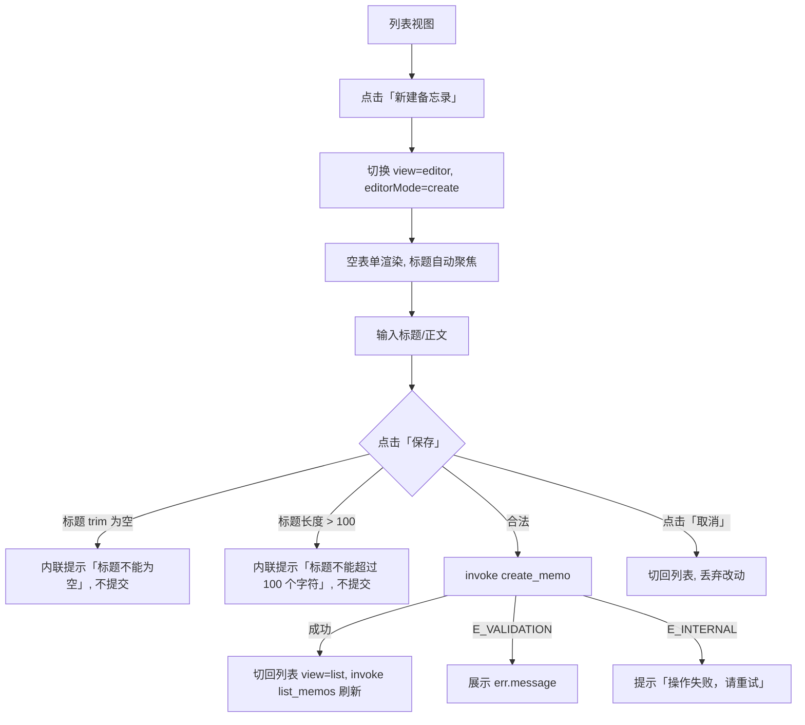
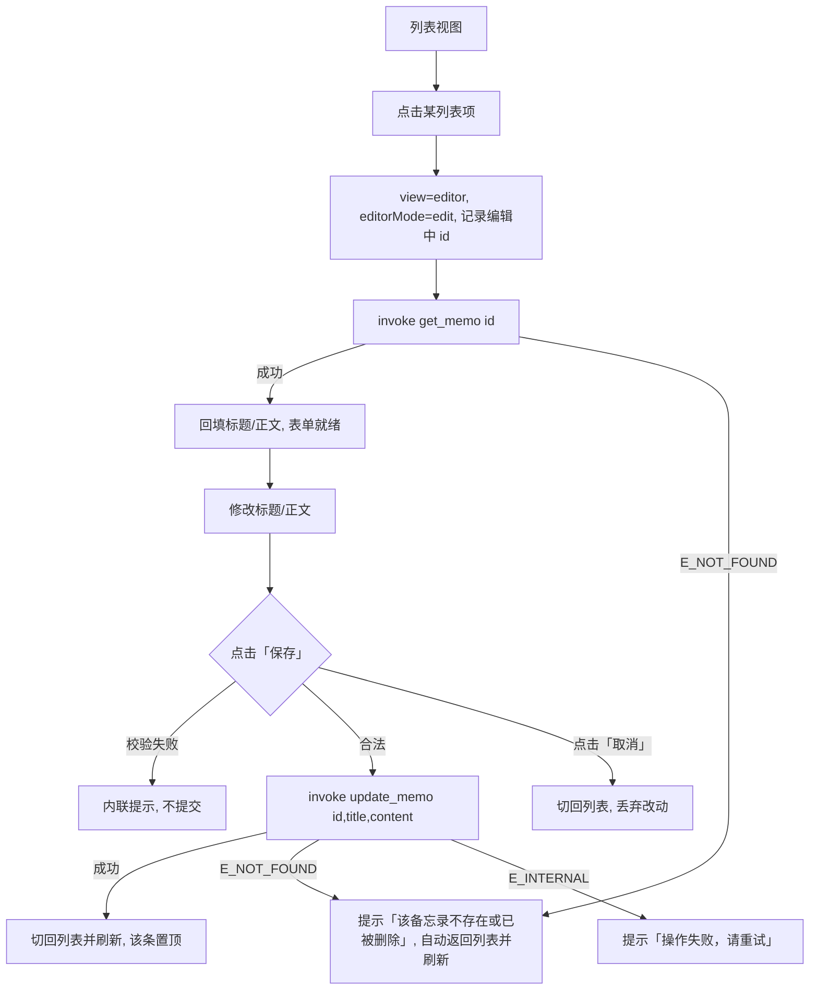
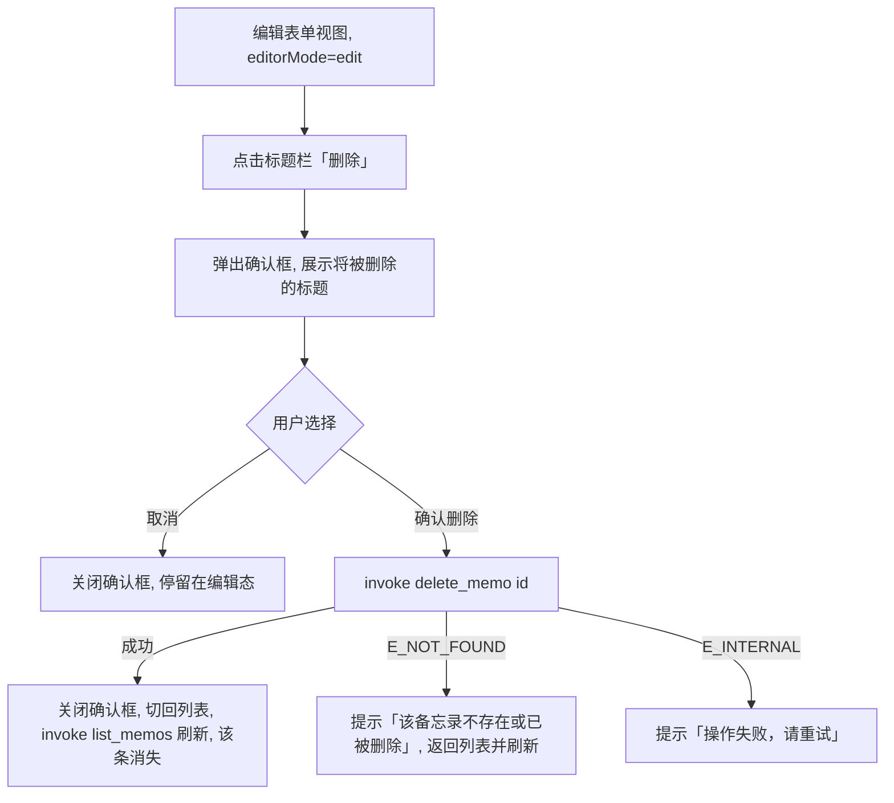
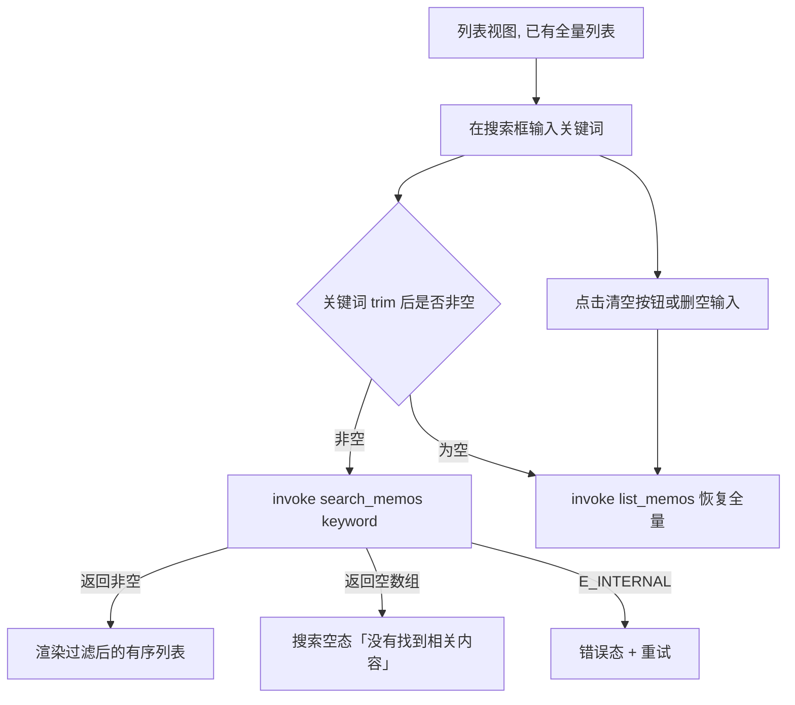

# My Echo 首版（P0）UI 设计文档

> 范围：仅 F01（备忘录增删改查）+ F02（搜索与排序），macOS 桌面端，单窗口。
> 事实源：AGENTS.md 5.2/5.4/5.5；契约对齐：docs/planner.md 第 2 节 6 条命令与三类错误码。
> 本文件只产出 UI/UX 设计规范，不写业务代码、不定义契约（已在 planner.md）。

---

## 1. 页面清单与结构说明

### 1.1 结构决策：单窗口 + 单页内视图状态切换

App 为**单窗口、单页面**，通过一个前端视图状态在「列表视图」与「编辑表单视图」间切换，**不引入路由、不建多窗口、不叠弹层承载编辑器**。

| 决策 | 选择 | 理由 |
|---|---|---|
| 视图组织 | 单页内视图状态切换 | P0 仅两类 UI（列表 + 表单），无深层导航；单页状态切换成本最低、焦点清晰、无需 URL/路由 |
| 视图状态 | `view: 'list' \| 'editor'` | 以布尔/枚举状态驱动，纯内存状态，刷新后回列表 |
| 编辑模式 | `editorMode: 'create' \| 'edit'` | 新建与编辑共用同一表单组件，仅标题/回填/是否展示删除按钮不同 |
| 窗口大小 | 建议默认 720×560，最小 560×440，可拉伸 | 备忘录为窄文本场景，纵向布局聚焦内容区 |

### 1.2 视图清单

| 视图 | 视图标识 | 承载内容 |
|---|---|---|
| 列表视图 | `view = 'list'` | 顶部工具栏（应用标题 + 新建按钮）、搜索框、备忘录列表 |
| 编辑表单视图 | `view = 'editor'` | 顶部工具栏（返回按钮 + 标题/删除按钮）、标题输入框、正文输入框、保存按钮 |

### 1.3 列表视图——信息层级与布局（自上而下）

1. **标题栏区**（透传 macOS 原生 traffic light 之下，非系统标题栏）：左侧应用名「My Echo」，右侧主操作按钮「新建备忘录」。
2. **搜索框**：常驻列表视图顶部，占满宽度；placeholder「搜索标题或内容」；右侧带一个可点的清空按钮（仅输入非空时显示）。
3. **列表区**：纵向滚动；每项展示「标题 + 本地时间 + 正文摘要」，最新在前（契约已由 `list_memos` 的 `updated_at` 倒序保证，前端不重排）。
4. **时间列规则**：展示 `updated_at` 转本地时区后的 `YYYY-MM-DD HH:mm`；当天数据可显示为 `HH:mm`（仅显示形式差异，不影响契约字段）。

列表项仅呈现两条核心信息（标题、时间），正文可选展示单行摘要（超出省略号截断），减少信息噪声。

### 1.4 编辑表单视图——信息层级与布局（自上而下）

1. **标题栏区**：左侧「返回」按钮（返回列表）；右侧上下文操作——编辑模式显示「删除」按钮，新建模式不显示。
2. **标题输入框**：单行，占满宽度，font-size 放大；底部/右侧展示剩余字符计数（`当前长度 / 100`，超限时变红并拦截）。
3. **正文字输入框**：多行 TextArea，自动撑满剩余高度，允许为空；placeholder「正文（可选）」。
4. **底部操作区**：`取消`（返回列表，丢弃改动） + `保存`（主操作按钮，右对齐）。

### 1.5 各视图状态定义

| 视图 | 状态 | 触发条件 | 界面呈现 |
|---|---|---|---|
| 列表 | 加载态 | `list_memos` 请求中 | 中央 loading 指示 + 文案「加载中…」（列表区域） |
| 列表 | 数据就绪态 | 列表返回非空 | 正常渲染列表项 |
| 列表 | 空态（无备忘录） | 列表返回空数组 | 空态插画/图标 + 主文案「还没有备忘录」+ 副文案「点击右上角“新建备忘录”开始记录」+ 主按钮「新建备忘录」 |
| 列表 | 搜索空态 | 搜索关键词非空且返回空数组 | 空态图标 + 主文案「没有找到相关内容」+ 副文案「换个关键词试试」 |
| 列表 | 错误态 | `list_memos` / `search_memos` 抛错 | 见 1.6 错误文案表，含「重试」按钮 |
| 编辑 | 回填加载态 | 编辑模式调 `get_memo` 中 | 表单禁用，中央 loading「加载中…」 |
| 编辑 | 表单就绪态 | 新建直接进入 / 回填完成 | 可编辑 |
| 编辑 | 保存中 | `create_memo` / `update_memo` 请求中 | 保存按钮禁用 + spinner，其余表单禁用 |
| 编辑 | 校验错误 | 前端校验失败（标题空/超长） | 标题输入框下内联错误文案 + 红边；见 1.6 |
| 编辑 | 失败态 | 命令抛错 | 顶部/表单顶部错误提示条 |

### 1.6 错误码 → 用户可见中文文案（契约对齐）

> 文案职责：前端本地校验错误直接本地生成；命令层错误优先采用 `err.message`，但需对三类 code 提供兜底文案。

| 错误码（AppError.code） | 触发场景 | 本地校验是否已拦截 | 用户可见文案策略 |
|---|---|---|---|
| `E_VALIDATION` | 标题空、标题超 100、keyword 非法 | 是（表单/搜索框本地已拦截） | 表单内联提示：如「标题不能为空」「标题不能超过 100 个字符」；若绕过本地仍被后端拦，展示 `err.message`（中文） |
| `E_NOT_FOUND` | get/update/delete 时 id 不存在 | 否 | 统一文案「该备忘录不存在或已被删除」；用户确认后自动返回列表并刷新 |
| `E_INTERNAL` | SQLite 读写等内部异常 | 否 | 统一文案「操作失败，请重试」，并在详情区可选附 `err.message` |

**错误呈现载体**：列表视图错误用整页错误态（含重试按钮）；编辑视图错误用表单顶部错误提示条（可关闭）。

---

## 2. 关键交互流程

### 2.1 新增备忘录



- 保存按钮语义：仅「保存」一个主按钮，回车在标题/正文输入框触发保存（TextArea 内回车为换行，不触发保存）。
- 成功后列表自动刷新，新条目因 `updated_at` 最新位于顶部。

### 2.2 编辑备忘录（含 get_memo 回填）



- 回填期间禁用表单，避免误编辑；回填失败不进入可编辑态。
- 编辑成功后条目因 `updated_at` 刷新而排到列表顶部。

### 2.3 删除备忘录（含确认框）



- **删除入口仅在编辑模式标题栏**（不在列表项上直接放删除），降低误删概率；流程图遵循「删除前弹确认框」硬约束。
- 确认框文案：标题「删除备忘录」；正文「确定要删除“{title}”吗？此操作不可撤销。」；按钮 `取消`（次要）/ `删除`（危险）。

### 2.4 搜索备忘录（输入过滤 / 清空恢复）



- 交互选型：**输入防抖后自动触发搜索**（建议 300ms debounce），兼顾手感与请求量；清空输入立即回切 `list_memos`。
- 搜索期间列表进入「搜索中」加载态可静默显示 loading，避免闪烁（实现方可按需省略，但不得阻塞输入）。
- 结果仍按 `updated_at` 倒序，前端信任契约顺序，不本地重排。

---

## 3. 设计令牌表（CSS 变量级）

### 3.1 深浅色方案决策

选用 **`prefers-color-scheme` 自动跟随系统 + 两套 CSS 变量覆盖**：`@media (prefers-color-scheme: dark)` 下换 dark 变量值，浅色为默认。macOS 桌面应用应尊重用户系统外观，不强制单套配色；不做应用内手动切换（P0 不加偏好设置）。

### 3.2 色板

> Light = `:root` 默认值；Dark = `@media (prefers-color-scheme: dark)` 覆盖值。

| 变量名 | Light 默认值 | Dark 值 | 用途 |
|---|---|---|---|
| `--color-bg` | `#f5f5f7` | `#1e1e1e` | 窗口/页面主背景 |
| `--color-surface` | `#ffffff` | `#2c2c2e` | 卡片、列表项、输入框、工具栏表面 |
| `--color-surface-hover` | `#e8e8ed` | `#3a3a3c` | 列表项 hover、下拉高亮 |
| `--color-border` | `#d2d2d7` | `#48484a` | 分割线、输入框边框 |
| `--color-text` | `#1d1d1f` | `#f5f5f7` | 主文字（标题、正文） |
| `--color-text-secondary` | `#6e6e73` | `#a1a1a6` | 次文字（时间、摘要） |
| `--color-text-tertiary` | `#86868b` | `#86868b` | 弱文字（占位、空态副文案） |
| `--color-accent` | `#0071e3` | `#0a84ff` | 强调色（主按钮、焦点、选中） |
| `--color-accent-hover` | `#0077ed` | `#3395ff` | 主按钮 hover |
| `--color-accent-active` | `#006edb` | `#0479e8` | 主按钮按下 |
| `--color-danger` | `#ff3b30` | `#ff453a` | 危险操作（删除按钮、错误边框） |
| `--color-danger-hover` | `#d70015` | `#ff6961` | 危险按钮 hover |
| `--color-focus-ring` | `rgba(0,113,227,0.4)` | `rgba(10,132,255,0.4)` | 焦点环 |
| `--color-shadow` | `rgba(0,0,0,0.12)` | `rgba(0,0,0,0.45)` | 阴影基准色 |
| `--color-success` | `#34c759` | `#32d74b` | 成功反馈（可选，P0 以列表刷新为主） |

### 3.3 字体（字号 / 字重）

| 变量名 | 值 | 用途 |
|---|---|---|
| `--font-family` | `-apple-system, BlinkMacSystemFont, "SF Pro Text", "Helvetica Neue", "PingFang SC", sans-serif` | 全局字栈（含中文回退） |
| `--font-size-xs` | `11px` | 字符计数、弱提示 |
| `--font-size-sm` | `13px` | 时间、摘要、正文输入 |
| `--font-size-md` | `14px` | 列表标题、控件默认 |
| `--font-size-lg` | `17px` | 编辑标题输入 |
| `--font-size-xl` | `20px` | 应用名 |
| `--font-weight-regular` | `400` | 正文、摘要 |
| `--font-weight-medium` | `500` | 按钮、列表标题 |
| `--font-weight-semibold` | `600` | 强调标题、应用名 |
| `--line-height-tight` | `1.3` | 标题、按钮 |
| `--line-height-normal` | `1.5` | 正文、摘要 |

### 3.4 间距

| 变量名 | 值 | 用途 |
|---|---|---|
| `--space-1` | `4px` | 最小间距、图标与文字间隙 |
| `--space-2` | `8px` | 列表项内缩进 |
| `--space-3` | `12px` | 列表项内边距、搜索框与列表间隙 |
| `--space-4` | `16px` | 内容区边距、表单字段间距 |
| `--space-5` | `20px` | 区块间距 |
| `--space-6` | `24px` | 弹窗内边距、工具栏上下留白 |
| `--space-8` | `32px` | 空态上下留白 |

### 3.5 圆角

| 变量名 | 值 | 用途 |
|---|---|---|
| `--radius-sm` | `6px` | 输入框、小控件 |
| `--radius-md` | `8px` | 按钮、列表项 |
| `--radius-lg` | `10px` | 弹窗 |
| `--radius-full` | `999px` | 圆形清空按钮、计数徽标 |

### 3.6 阴影

| 变量名 | 值 | 用途 |
|---|---|---|
| `--shadow-sm` | `0 1px 2px var(--color-shadow)` | 列表项、卡片轻微投影 |
| `--shadow-md` | `0 8px 24px var(--color-shadow)` | 弹窗投影 |
| `--shadow-focus` | `0 0 0 3px var(--color-focus-ring)` | 输入框/按钮焦点环（用 box-shadow 实现） |

> CSS 变量互引用（如阴影引用色板变量）为设计令牌的既定写法，落地时直接可用。

---

## 4. 组件规范清单

> 以下为 Vue3 组件 Props/Events/状态定义，字段可直接映射为 CompositionAPI 组件；不写实现代码。

### 4.1 通用类型（供组件 Props 引用，与本项目 `types/memo.ts` 对齐）

```ts
type View = 'list' | 'editor';
type EditorMode = 'create' | 'edit';

interface Memo {
  id: number;
  title: string;
  content: string;
  created_at: string; // ISO8601 UTC
  updated_at: string; // ISO8601 UTC
}
```

### 4.2 Button 按钮

| Props | 类型 | 必填 | 默认 | 说明 |
|---|---|---|---|---|
| `label` | `string` | 是 | — | 按钮文案 |
| `variant` | `'primary' \| 'secondary' \| 'danger' \| 'ghost'` | 否 | `'secondary'` | 主/次/危险/幽灵 |
| `size` | `'sm' \| 'md' \| 'lg'` | 否 | `'md'` | 尺寸档 |
| `disabled` | `boolean` | 否 | `false` | 禁用态 |
| `loading` | `boolean` | 否 | `false` | 加载中（禁用 + spinner） |
| `type` | `'button' \| 'submit'` | 否 | `'button'` | 原生类型 |

| Events | 说明 |
|---|---|
| `click` | 点击（disabled/loading 时不触发） |

| 状态 | 呈现 |
|---|---|
| 默认 | 无投影/轻投影，按 variant 上色 |
| hover | `--color-*-hover` |
| active | `--color-*-active` |
| disabled | 降低不透明度（约 0.5），不可点 |
| loading | 文案旁 spinner，禁用点击 |

- variant 配色：`primary` 用 `--color-accent` 白字；`danger` 用 `--color-danger` 白字；`secondary` 用 `--color-surface` + 边框；`ghost` 透明背景，hover 见表面色。

### 4.3 TextInput 单行输入框 / TextArea 多行输入

| Props | 类型 | 必填 | 默认 | 说明 |
|---|---|---|---|---|
| `modelValue` | `string` | 是 | `''` | 受控值（v-model） |
| `placeholder` | `string` | 否 | `''` | 占位文案 |
| `multiline` | `boolean` | 否 | `false` | false=单行，true=TextArea |
| `maxlength` | `number` | 否 | — | 长度上限 |
| `disabled` | `boolean` | 否 | `false` | 禁用 |
| `error` | `string` | 否 | `''` | 非空为错误文案，染色边框 + 内联提示 |
| `autofocus` | `boolean` | 否 | `false` | 聚焦 |

| Events | 说明 |
|---|---|
| `update:modelValue` | 输入变更（v-model 双向） |
| `blur` / `focus` | 焦点变化 |

| 状态 | 呈现 |
|---|---|
| 默认 | `--color-surface` bg + `--color-border` 边框 |
| focus | `--shadow-focus` 焦点环 |
| error | 边框 `--color-danger` + 下方内联错误文案 |
| disabled | 降低不透明度，不可编辑 |

### 4.4 SearchBox 搜索框

| Props | 类型 | 必填 | 默认 | 说明 |
|---|---|---|---|---|
| `modelValue` | `string` | 是 | `''` | 关键词（v-model） |
| `placeholder` | `string` | 否 | `'搜索标题或内容'` | 占位 |

| Events | 说明 |
|---|---|
| `update:modelValue` | 输入变更；由上层决定 debounce 后触发 `search_memos` |
| `clear` | 点击清空按钮；上层回切 `list_memos` |

| 状态 | 呈现 |
|---|---|
| 空输入 | 仅输入框 + 放大镜图标 |
| 有输入 | 末尾显示清空按钮（`×`） |
| 聚焦 | 焦点环 |

### 4.5 MemoListItem 列表项

| Props | 类型 | 必填 | 默认 | 说明 |
|---|---|---|---|---|
| `memo` | `Memo` | 是 | — | 备忘录数据 |
| `selected` | `boolean` | 否 | `false` | 是否高亮（选中态） |
| `timeText` | `string` | 是 | — | 已本地化的时间文本（上层用 `updated_at` 转本地格式） |

| Events | 说明 |
|---|---|
| `click` | 点击进入编辑（上层切 view=editor 并调 `get_memo`） |

| 状态 | 呈现 |
|---|---|
| 默认 | 标题（`--font-weight-medium`）+ 时间（`--color-text-secondary`）+ 正文单行摘要 |
| hover | `--color-surface-hover` |
| selected | 强调色左边框/背景高亮 |

- 摘要规则：正文为空时不展示摘要行；非空时单行截断（CSS ellipsis），全部用 `--color-text-secondary` 小字号。

### 4.6 EmptyState 空态

| Props | 类型 | 必填 | 默认 | 说明 |
|---|---|---|---|---|
| `type` | `'empty' \| 'search'` | 是 | — | 区分「无备忘录」与「搜索无结果」 |
| `title` | `string` | 否 | — | 主文案，缺省用默认文案 |
| `description` | `string` | 否 | — | 副文案 |
| `actionLabel` | `string` | 否 | — | 主按钮文案，仅在 `empty` 时展示 |

| Events | 说明 |
|---|---|
| `action` | 点击「新建备忘录」（`empty` 态） |

| type | 默认文案 |
|---|---|
| `empty` | 主文案「还没有备忘录」；副文案「点击右上角“新建备忘录”开始记录」；按钮「新建备忘录」 |
| `search` | 主文案「没有找到相关内容」；副文案「换个关键词试试」；无按钮 |

### 4.7 ConfirmDialog 删除确认弹窗

| Props | 类型 | 必填 | 默认 | 说明 |
|---|---|---|---|---|
| `visible` | `boolean` | 是 | `false` | 是否显示 |
| `title` | `string` | 否 | `'删除备忘录'` | 弹窗标题 |
| `message` | `string` | 是 | — | 正文（含将被删标题，如「确定要删除“{title}”吗？此操作不可撤销。」） |
| `confirmText` | `string` | 否 | `'删除'` | 确认按钮文案 |
| `cancelText` | `string` | 否 | `'取消'` | 取消按钮文案 |
| `loading` | `boolean` | 否 | `false` | 删除请求中 |

| Events | 说明 |
|---|---|
| `confirm` | 点确认 → 上层调 `delete_memo` |
| `cancel` | 点取消/遮罩/ESC → 关闭 |

| 状态 | 呈现 |
|---|---|
| 打开 | `--shadow-md` 弹窗 + 半透明遮罩 |
| loading | 确认按钮 spinner + 禁用，阻止重复提交 |
| 关闭 | 不渲染 |

- 确认按钮为 `variant='danger'`；点击遮罩或 ESC 等效取消。

### 4.8 ErrorBanner 错误提示条（编辑态顶部）

| Props | 类型 | 必填 | 默认 | 说明 |
|---|---|---|---|---|
| `message` | `string` | 是 | — | 用户可见错误文案 |

| Events | 说明 |
|---|---|
| `close` | 关闭提示条 |

### 4.9 组件与调用点映射（契约标注）

| 组件 | 触发契约命令 |
|---|---|
| 列表视图（加载） | `list_memos` |
| 列表视图（搜索） | `search_memos` |
| 编辑视图（进入编辑） | `get_memo` |
| 编辑视图（保存-新建） | `create_memo` |
| 编辑视图（保存-编辑） | `update_memo` |
| ConfirmDialog（确认删除） | `delete_memo` |

---

## 附：关键设计决策汇总

1. **单页 vs 多视图**：选单页 + 视图状态切换（`view: 'list' | 'editor'`），不引路由、不建弹层编辑器。P0 数据流简单，单页状态机最直接、焦点清晰、无 URL 与历史栈负担。
2. **深浅色方案**：选 `prefers-color-scheme` 自动跟随系统，深浅两套 CSS 变量，浅色为默认，不做应用内手动切换（P0 不加偏好设置）。
3. **删除入口收敛**：删除按钮只放在编辑模式标题栏 + 确认弹窗二次确认，列表项不直接暴露删除，遵守「删除前弹确认框」并降低误删。
4. **搜索交互**：输入防抖 300ms 自动触发 `search_memos`，清空即回 `list_memos`，前端信任契约倒序、不本地重排。
5. **错误提示分层**：本地校验错误用表单内联；`E_NOT_FOUND` 统一「该备忘录不存在或已被删除」并自动返回列表；`E_INTERNAL` 用「操作失败，请重试」兜底。